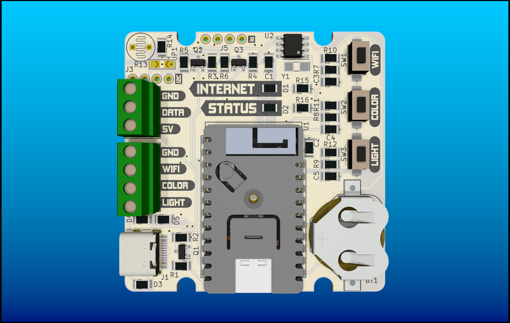
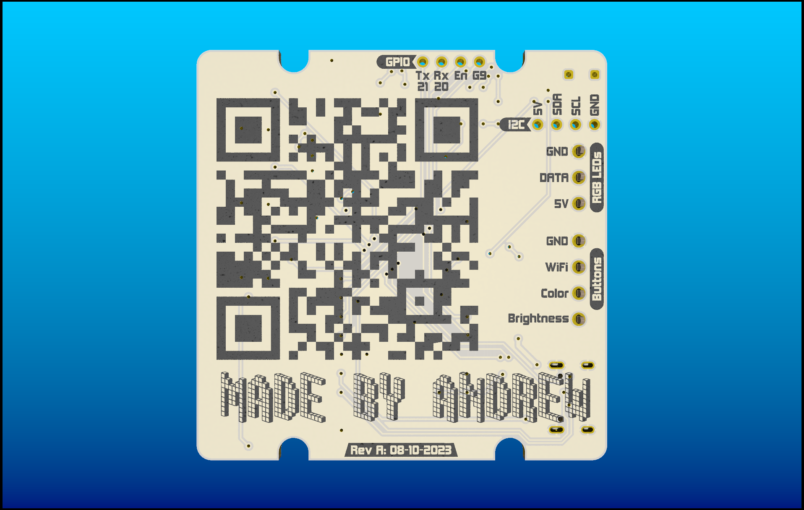

# Word Clock Electronics

## Summary

  
  

The word clock is powered by a custom ESP32-C3 based controller, using a PCF85263A real time clock module and a CR1632 backup battery.

The board was designed to use inexpensive parts, and has a small form factor which is inexpensive to get manufactured by online PCB fabricators. All components can be soldered by hand, and the back is unpopulated which allows using a hotplate and solder paste.

## Bill of Materials

| Ref              | Type            | Qnty | Part Number          | Part Description                      | Supplier                                                                                                  |
| ---------------- | --------------- | ---- | -------------------- | ------------------------------------- | ----------------------------------------------------------------------------------------------------------|
| BT1              | Battery Holder  | 1    | 3012TR               | CR1632 battery holder                 | [Digikey](https://www.digikey.ca/en/products/detail/keystone-electronics/3012TR/1978698)                  |
| C1               | Capacitor       | 1    | 0.1uF-1uF            | 0603-1206 X7R capacitor               |                                                                                                           |
| C2               | Capacitor       | 1    | 0.1uF-1uF            | 0603-1206 X7R capacitor               |                                                                                                           |
| C3, C4, C5       | Capacitor       | 3    | 0.1uF                | 0603-1206 X7R capacitor               |                                                                                                           |
| D1               | LED             | 1    | SMD LED              | 0603-1206 SMD LED                     |                                                                                                           |
| D2               | LED             | 1    | SMD LED              | 0603-1206 SMD LED                     |                                                                                                           |
| D3, D4, D5       | Diode           | 3    | CUS520,H3F           | External button protection diode      | [Digikey](https://www.digikey.ca/en/products/detail/toshiba-semiconductor-and-storage/CUS520-H3F/5114303) |
| J1               | USB-C Conn.     | 1    | USB4105-GF-A         | USB_C_Receptacle_USB2.0               | [Digikey](https://www.digikey.ca/en/products/detail/gct/USB4105-GF-A/11198441)                            |
| J2               | Screw Terminal  | 1    | EBWA-03-A            | External RGB LED connector            | [Digikey](https://www.digikey.ca/en/products/detail/adam-tech/EBWA-03-A/9830974)                          |
| J3               | Empty Headers   | 1    | n/a                  | 2.54mm external I2C breakout          |                                                                                                           |
| J4               | Screw Terminal  | 2    | EBWA-02-A            | External buttons connector            | [Digikey](https://www.digikey.ca/en/products/detail/adam-tech/EBWA-02-A/9830631)                          |
| J5               | Empty Headers   | 1    | n/a                  | 2.54mm GPIO breakout                  |                                                                                                           |
| JP1              | Jumper          | 1    | n/a                  | Brightness select jumper              |                                                                                                           |
| Q1, Q2, Q3       | N-MOSFET        | 3    | DMG2302UKQ-7         | Level shifter mosfet                  | [Digikey](https://www.digikey.ca/en/products/detail/diodes-incorporated/DMG2302UKQ-7/9769911)             |
| R1, R2           | Resistor        | 2    | 2.2kR                | 0603-1206 SMD resistor, signal pullup |                                                                                                           |
| R3, R5           | Resistor        | 2    | 2.2kR                | 0603-1206 SMD resistor, signal pullup |                                                                                                           |
| R4, R6           | Resistor        | 2    | 2.2kR                | 0603-1206 SMD resistor, signal pullup |                                                                                                           |
| R7, R8, R9, R14  | Resistor        | 4    | 10kR                 | 10kR 0603-1206 SMD resistor           |                                                                                                           |
| R10, R11, R12    | Resistor        | 3    | 1kR                  | 1kR 0603-1206 SMD resistor            |                                                                                                           |
| R13              | Photoresistor   | 1    | varies               | Generic THT photoresistor             |                                                                                                           |
| R15, R16         | Resistor        | 2    | varies               | LED resistors, size to D1 and D2      |                                                                                                           |
| SW1              | Button          | 1    | PTS636 SL43 SMTR LFS | WIFI push button                      | [Digikey](https://www.digikey.ca/en/products/detail/c-k/PTS636-SL43-SMTR-LFS/10071722)                    |
| SW2              | Button          | 1    | PTS636 SL43 SMTR LFS | Color push button                     | [Digikey](https://www.digikey.ca/en/products/detail/c-k/PTS636-SL43-SMTR-LFS/10071723)                    |
| SW3              | Button          | 1    | PTS636 SL43 SMTR LFS | Brightness push button                | [Digikey](https://www.digikey.ca/en/products/detail/c-k/PTS636-SL43-SMTR-LFS/10071722)                    |
| U1               | Microcontroller | 1    | K056                 | M5Stamp ESP32C3 module                | [Digikey](https://www.digikey.ca/en/products/detail/m5stack-technology-co-ltd/K056/15667527)              |
| U2               | RTC             | 1    | PCF85263AT/AJ        | Real time clock                       | [Digikey](https://www.digikey.ca/en/products/detail/nxp-usa-inc/PCF85263AT-AJ/5170041)                    |
| Y1               | Crystal         | 1    | CM315D32768HZFT      | 32.768kHz 12.5pF crystal              | [Digikey](https://www.digikey.ca/en/products/detail/citizen-finedevice-co-ltd/CM315D32768HZFT/5970266)    |

### Notes

- The footprints on the board for simple components are designed to work for 0603, 0805, and 1206 footprints (0402 may work for the brave). There are no specific part numbers listed.
- The resistor values for the LEDs, photoresistor, and the signal pullups can all be modified depending on need. 2.2kR for the signal pullups works well.

## DIY / Custom Solution

The firmware will work for any custom board (possibly a breadboard too) as long as the connections are the same as those listed in the schematic.
