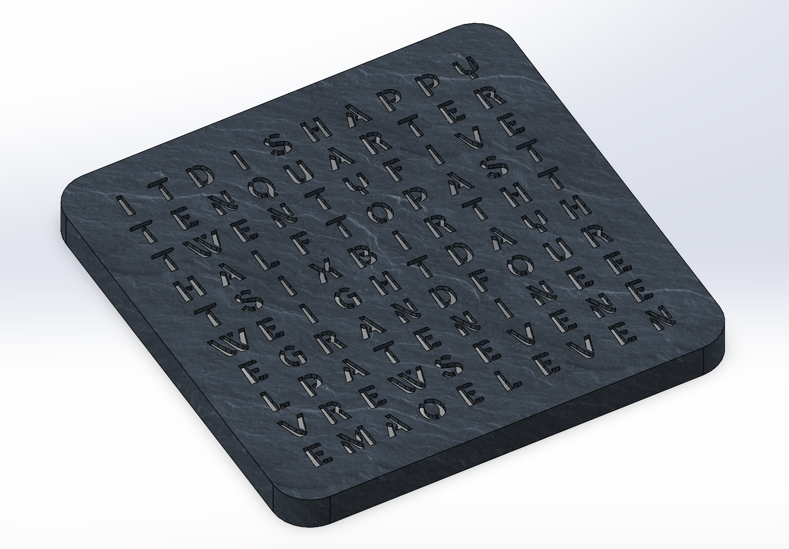
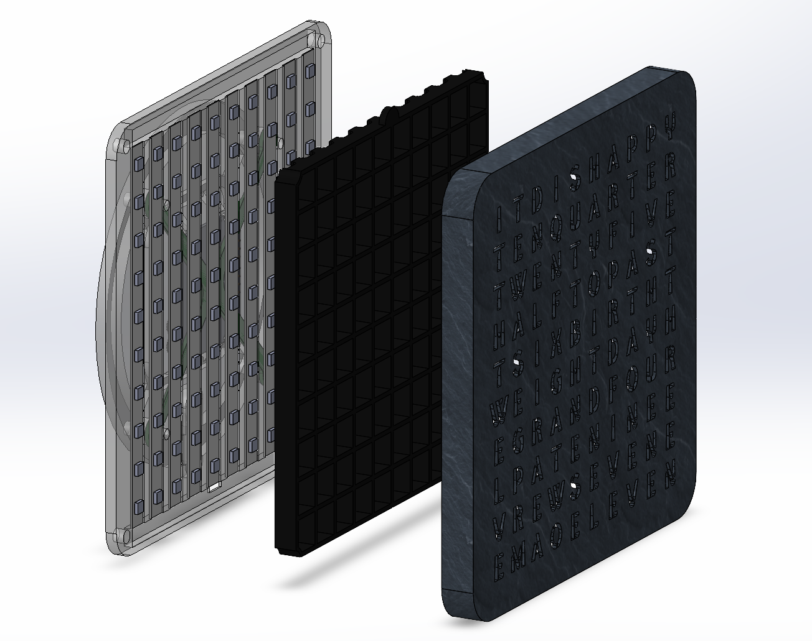
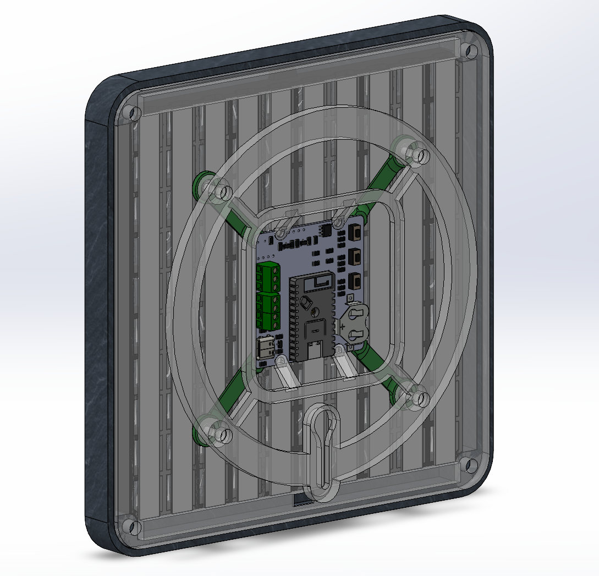
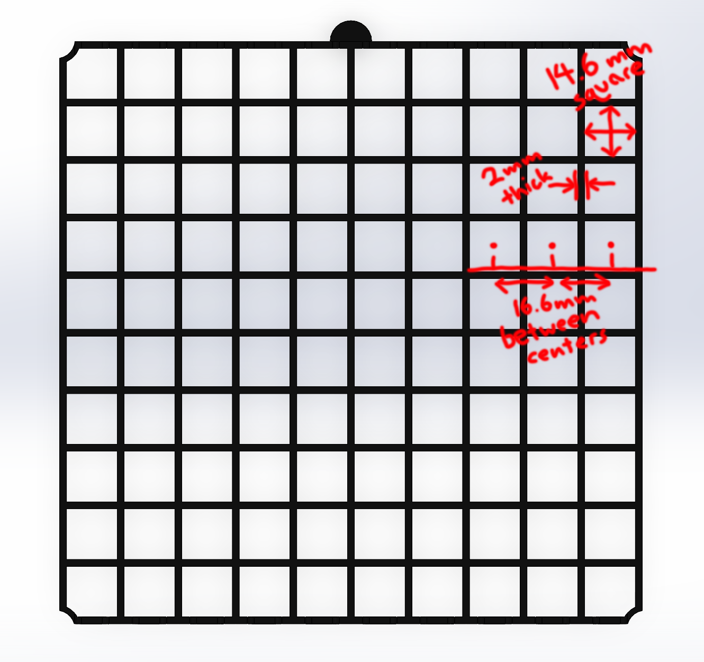

# Word Clock Mechanical Components (WIP)

## Summary

  
  

  
  

The word clock uses a 3D printed body, with an RGB LED strip cut into pieces and glued to a back plate.

## Required Parts

| Part                 | Qnty. | Description                                                               | Supplier                                                                                                                                                               |
| -------------------- |-------| ------------------------------------------------------------------------- | ---------------------------------------------------------------------------------------------------------------------------------------------------------------------- |
| LED Strip            | 1     | WS2812B (or similar) 60 LED / meter strip                                 | [Amazon #1](https://www.amazon.ca/BTF-LIGHTING-Individual-Addressable-60Pixels-Non-Waterproof/dp/B088BPGMXB), [Amazon #2](https://www.amazon.ca/gp/product/B014R5PC42) |
| M3 Heat Set Nuts     | 4     | Brass threaded nuts, buy a kit                                            | [Amazon #3](https://www.amazon.ca/Assortment-Premium-Threaded-Embedment-Printing/dp/B0CTDBXGCF)                                                                        |
| M4 Heat Set Nuts     | 4     | Brass threaded nuts, buy a kit                                            | [Amazon #3](https://www.amazon.ca/Assortment-Premium-Threaded-Embedment-Printing/dp/B0CTDBXGCF)                                                                        |
| M3x8 Screw           | 4     | Machine screw, any will do                                                | [Amazon #4](https://www.amazon.ca/Hilitchi-510-Pcs-Button-Socket-Assortment/dp/B073SWNV5N)                                                                             |
| M4x8 Screw           | 4     | Button cap, but any will do                                               | [Amazon #4](https://www.amazon.ca/Hilitchi-510-Pcs-Button-Socket-Assortment/dp/B073SWNV5N)                                                                             |
| Hot Glue             | n/a   | For the LED strips / strain relief                                        | n/a                                                                                                                                                                    |
| Solder               | n/a   | Any                                                                       | n/a                                                                                                                                                                    |
| Wire                 | n/a   | 3 conductor wire for LED strip to controller, 1 conductor for connections | n/a                                                                                                                                                                    |
| USB-C Charging Cable | 1     | Slim right angle cable works best                                         | [Amazon #5](https://www.amazon.ca/Agtray-4-Pack-Braided-Compatible-Samsung/dp/B0B6B7NK35)                                                                              |
| USB Power Supply     | 1     | \>5W properly rated supply                                                | [Digikey](https://www.digikey.ca/en/products/detail/qualtek/QFWC-10-05/9771106)                                                                                        |

## 3D Printing

Note: Using a translucent filament color for the back panel and mount causes a nice backlight / glow effect on the mounting surface.

Note: Using a textured print plate will apply the textures to the clock face.

* Choose a darker filament for the clock body (or print solid infill) to prevent light transmission.
* Print the divider in black filament, or another color with zero transmission at 2mm thickness.
* Material does not matter, PLA or PETG work fine.
* Use a smaller nozzle (0.4mm or less) for the clock body to preserve detail on the clock face.

## Running The Clock Creation Script

### Requirements

1. Install [OpenSCAD](https://openscad.org/downloads.html) on your computer.
   1. On Windows, ensure the installed folder is added to the system %PATH% variable.
2. Install Python on your computer
3. Install a compatible stencil font on your computer.
   1. On Windows, you need to right click "Install For All Users" for OpenSCAD to have access to it.
   2. There are two stencil fonts (free for all use) included in the `/free_fonts` folder.

### Generating

1. Modify the `make_clock_body.txt` file to reflect your clock configuration:
   1. (TODO: unsupported) Add the font
   2. (TODO: unsupported) Add the text size
   3. Add the character layout
2. Run the `make_clock.py` script using Python and wait for completion.
3. Use the `Custom_Body.stl` file as your clock body.

#### Troubleshooting

All of the requirements need to be satisfied. The scripts do not perform sophisticated error checking and may not provide useful debug messages.

## DIY / Custom Solution

Creating a custom clock body (or using an existing one) is completely supported.

(TODO: more info)